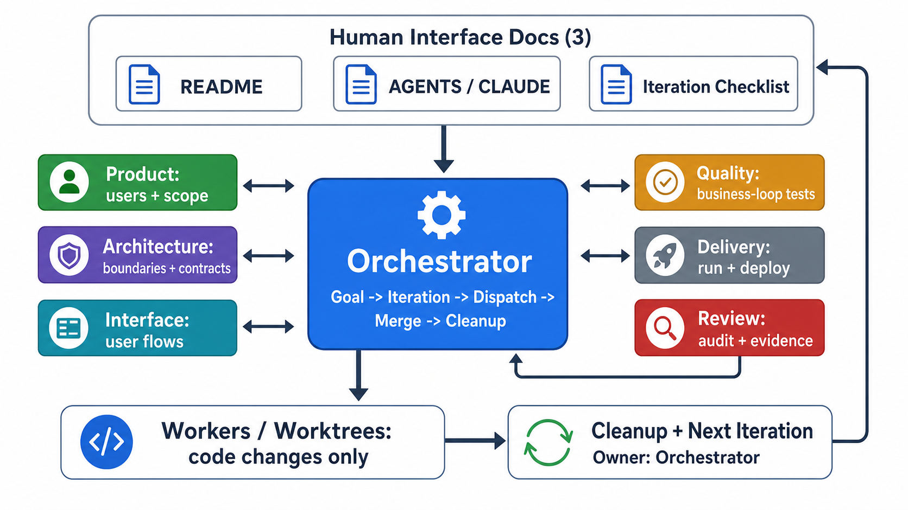

# Skills

可复用的 Codex skills。目前包含 PROQAID：面向多 Agent 软件开发的迭代治理体系。

## PROQAID



PROQAID 由 Product、Review、Orchestrator、Quality、Architecture、Interface、Delivery 七个职责组成。它关注的不是任务排期，而是长期 AI 开发中的目标、边界、证据、并发写入和文档卫生。

核心规则：

- Full 覆盖七类责任，但只启动本轮受影响的角色；Orchestrator 在派发前执行迭代规模门，过大范围必须先向用户提出拆分。
- Architecture、Interface 和 Quality 只冻结受影响的模块边界、公开契约和测试所有权，Review 随后执行一次 Design Freeze 审计。
- Orchestrator 负责调度、依赖路由、串行集成和异常处理；生产代码只由具备独立写入范围的临时 worker 修改。
- PROQAID 是迭代内唯一治理层，不与 Superpowers 或其他计划、子代理开发、Review 编排流程同时运行；TDD、worktree、系统化调试和完成前验证只作为底层技术使用。
- 确定性检查优先交给项目现有工具、CI/CD 和测试平台；Quality/Delivery 定义合同并审核证据，不用 Agent 上下文模拟工具执行。
- Full 与 Lite 都在入口阶段向 Human Operator 一次性提交宿主机、权限、账号、秘密和环境准备包；preflight 通过后自动执行，仅在无法安全绕过的阻断时再次请求用户。
- 安全的独立任务尽量占满可用并发槽，共享文件和依赖链保持串行。
- Worker 负责模块 TDD；Review 只 fresh 验证高风险变化；Quality 每个集成波次验证一次跨模块业务闭环；最终阶段运行一份完整证据集。
- 治理文档必须有明确下游读者和决策用途。默认不维护 agent status 文件，也不保留重复的 inbox/outbox 副本。
- 测试绿色不能替代业务闭环、真实运行证据和最终审计。

详细规则见 [proqaid/SKILL.md](./proqaid/SKILL.md)；人工准备、环境、测试和外部证据合同按需读取 [execution-contracts.md](./proqaid/references/execution-contracts.md)。

## 安装

将 `proqaid/` 复制到 Codex skills 目录：

```text
~/.codex/skills/proqaid/
```

然后在新任务中使用 `$proqaid`，或直接要求 Codex 使用 PROQAID 运行软件项目迭代。

PROQAID 支持 Lite 和 Full。只有用户明确指定 Lite 时才使用 Lite，否则默认 Full；运行中不得自动切换级别。
